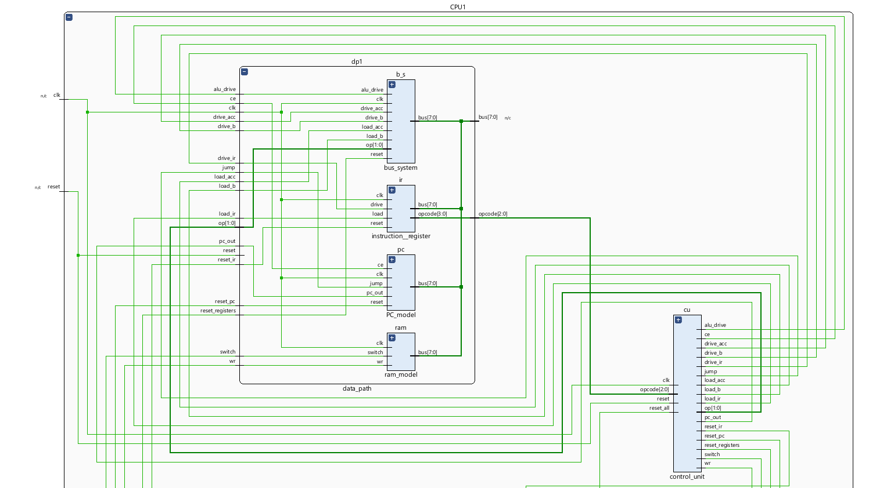
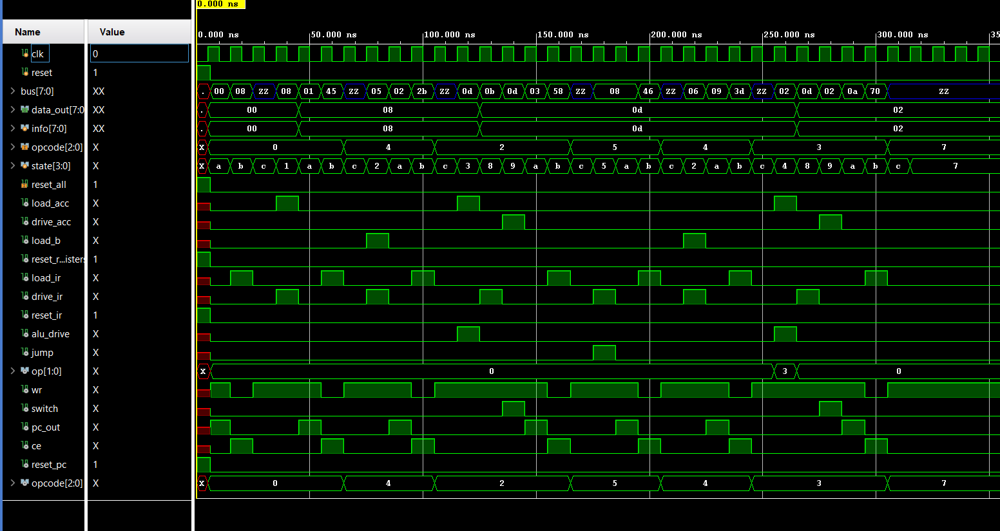

# A working CPU

## 8-bit CPU — Built from Scratch in Verilog (Work in Progress)

A custom 8-bit CPU built bottom-up in Verilog — starting from individual logic gates and progressing to a full datapath with a microcoded control unit, simulated and verified in AMD Xilinx Vivado.

**Status:** Datapath and Control Unit FSM are written and wired into a top-level `cpu` module.Running a complete instruction set end-to-end — actively in progress.

## Why this project

Most of the building blocks in this CPU were developed and verified independently first, then integrated:

- 4-bit Ripple Carry Adder
- 4-bit ALU (Add, Sub, Mul, Div) — including a hand-built gate-level multiplier
- Tri-state shared-bus register system (ACC, B-register) with direct ALU operand wiring
- 16x8 Synchronous RAM with separate address-latch and data-write modes
- Program Counter with reset, auto-increment, and jump
- Instruction Register
- Control Unit — a Moore FSM sequencing fetch, decode, and execute states per instruction

Each module was built, tested, and debugged in isolation before being connected — this README documents the integration stage.

## Architecture

```
                    ┌────────────────┐
                    │  Control Unit  │  (FSM: Fetch → Decode → Execute)
                    └───────┬────────┘
                            │ control signals
                            ▼
   ┌─────┐   ┌─────┐   ┌────────┐   ┌─────┐   ┌─────┐
   │  PC │───│ RAM │───│   IR   │───│ ACC │───│  B  │
   └──┬──┘   └──┬──┘   └───┬────┘   └──┬──┘   └──┬──┘
      └──────────┴──────────┴───────────┴─────────┘
                    shared tri-state bus
                            │
                            ▼
                       ┌─────────┐
                       │   ALU   │ ← reads ACC/B via direct wires, not the bus
                       └─────────┘
```

## Instruction Set

| Opcode | Instruction | States |
|---|---|---|
| 000 | LOAD (into ACC) | LoadA1 → LoadA2 |
| 001 | STORE (ACC → RAM) | Store1 → Store2 |
| 010 | ADD | Add → Store1 (writes back ALU result) |
| 011 | SUB | Sub → Store1 |
| 100 | LOADB (into B) | LoadB1 → LoadB2 |
| 101 | JUMP | Jump |
| 110 | OUT | Out |
| 111 | HALT | Halt |

Every instruction begins with a universal 2-phase Fetch (PC drives address → RAM latches it, then RAM drives data → IR captures it) followed by a Decode state that branches based on the opcode in IR.

## Files

| File | Description |
|---|---|
| `cpu.v` | Top-level module — instantiates `control_unit` and `data_path` |
| `control_unit.v` | Moore FSM — generates all control signals from current state and opcode |
| `data_path.v` | Wires together PC, RAM, IR, ACC, B-register, and ALU on the shared bus |
| `instruction_register.v` | Holds the fetched instruction for decode |

## Design decisions worth noting

**The ALU never reads from the shared bus.** ACC and B each expose a second, always-live direct wire straight into the ALU. The bus is reserved purely for moving data between registers and writing results back — this mirrors how real CPU datapaths separate data movement from computation.

**RAM access costs 2 states, not 1.** Because RAM only latches a new address on a clock edge and only drives valid data the cycle after, every instruction touching memory (LOAD, STORE, LOADB, and Fetch itself) needs two FSM states. ADD, SUB, JUMP, and OUT need only one state each, since they don't touch RAM and the ALU computes combinationally.

`ADD/SUB` automatically stores the value so that the programs stored in RAM are used efficiently.This saves up space by not including the `STORE's` program in the RAM.

## Schematic 


## Simulation Waveform

## Tools Used

- AMD Xilinx Vivado (behavioral simulation, waveform analysis, synthesized schematics)
- Verilog HDL
